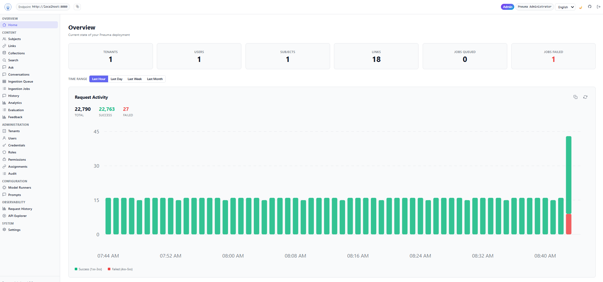
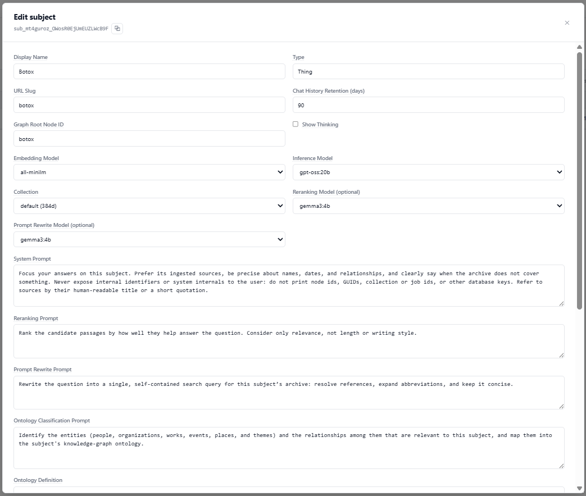
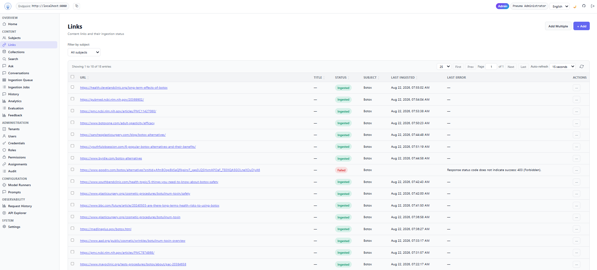
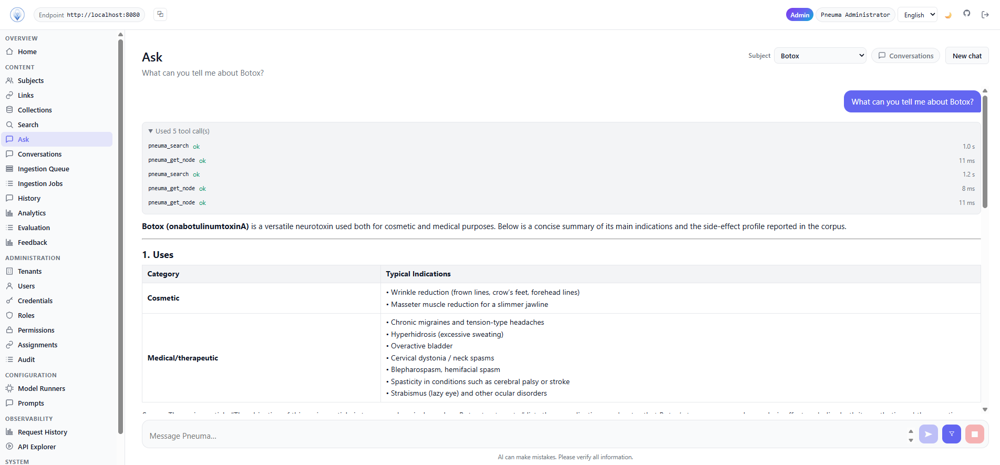

<!-- Logo -->
<p align="center"></p>

<h1 align="center">Pneuma — breathing life into your information</h1>

<p align="center">
  <strong>v0.1.0 · ALPHA</strong><br>
  <a href="LICENSE"></a>
  
  
  
</p>

**Pneuma** is a self-hostable **knowledge-graph data platform**. Point it at a body of source material — documents, web pages, and other artifacts about any kind of subject — and it ingests each one, extracts its semantic content, classifies it into an editable **ontology**, merges it into a **knowledge graph**, and indexes it for grounded, cited retrieval. You get a queryable graph of entities and relationships, a hybrid (lexical + semantic) search and question-answering layer that always cites its sources, and full provenance, rights, and multi-tenant access control — exposed through a REST API, an in-process **Model Context Protocol (MCP)** server, and three operator dashboards.

Pneuma ships as a fully orchestrated **Docker Compose** stack: one command brings up the platform, the knowledge graph, the vector + full-text store, the document-processing pipeline, a local LLM runner, object storage, and the observability stack. It is the **intelligence layer** you build on — not a finished end-user product.

> **This is alpha software.** Everything in Pneuma — APIs, database schemas, configuration, dashboards, and defaults — is subject to change without notice while the project is in its `0.x` series. Pneuma will adopt [semantic versioning](https://semver.org/) at its stable **1.0** release; until then, treat every build as a moving target and pin the exact version you deploy.

## Screenshots

<details>
<summary>Click to expand a quick tour of the admin dashboard.</summary>

<br />

**Overview.** The admin home surfaces the current state of a deployment — tenants, users, subjects, links, and queued/failed ingestion jobs — above a live request-activity chart (success vs. failed) with selectable time ranges.



<br />

**Per-subject configuration.** Each subject has its own settings: display name and URL slug, embedding/inference models (and optional reranking/prompt-rewrite models), a fixed-dimensionality collection, a chat-history retention window, a show-thinking toggle, and per-subject prompt overrides (system, reranking, prompt-rewrite, and ontology classification/definition) that layer on top of the global defaults.



<br />

**Ingestion & links.** The Links view lists every content link and its ingestion status (Ingested / Failed, with the last error), filterable by subject and paginated like every other table — each row is a source that flowed through the document → graph → search pipeline.



<br />

**Grounded Q&A.** The Ask surface answers questions from the curated corpus and shows its work: an expandable tool-call trace (each `pneuma_search` / `pneuma_get_node` call with timing) above a grounded, Markdown-formatted answer, with the conversation switcher for managing threads.



</details>

---

## Who Pneuma is for

- **Data engineers & data users** — turn a pile of unstructured documents and pages into a **structured, queryable knowledge graph** with typed entities, relationships, provenance, and rights — without hand-rolling an extraction pipeline. Explore it visually, search it, and pull it into downstream systems over a clean REST API.
- **AI engineers** — get a **production-grade RAG backend** out of the box: hybrid retrieval, graph-neighbor expansion, prompt rewrite, optional LLM re-ranking, conversation compaction, cited answers with an explicit "insufficient support" refusal, a built-in LLM-judged evaluation harness, and a first-class **MCP** surface so agents drive the platform through the same auth and audit path as everything else. Bring your own model — OpenAI, Gemini, or fully offline **Ollama**.
- **Software developers** — a self-hostable platform with an **OpenAPI-described REST API**, C#/JS/Python SDKs, multi-tenant **RBAC** with a full audit trail, request-history capture, Prometheus metrics + OpenTelemetry traces, and a provider-neutral data layer that runs on PostgreSQL, SQLite, MySQL, or SQL Server. One `docker compose up` and you're building.

---

## Features

- **Ingestion pipeline** — Submit a document or URL and Pneuma runs it through an explicit **Categorize** phase (fetch → type-detect → extract semantic cells → classify into the ontology) and a **Hydrate** phase (merge into the graph, chunk, embed, and index), with per-stage live logs, prompt-provenance capture for reproducibility, and best-effort artifact storage (source, atoms, chunks, vectors, subgraph) in S3.
- **Editable, natural-language ontology** — The ontology that drives classification is a **prompt you can rewrite** — reshape the graph's node and edge types (Subject, Person, Organization, Work, Collection, Event, Place, Topic, …) without touching code. The graph merge accepts whatever types your ontology defines.
- **Knowledge graph** — Every source becomes provenance-anchored nodes and edges in **LiteGraph**, with entity resolution (canonical-name dedup), per-tenant isolation, and a node explorer for contents, links, adjacent nodes, relationships, rights, and authority.
- **Hybrid retrieval & grounded answers** — Blends lexical (full-text) and semantic (vector) search over **RecallDB** (Postgres + pgvector) with optional **graph-neighbor expansion**, optional **prompt rewrite** and **LLM re-ranking**, and returns a cited answer or an explicit refusal. One shared service backs both the REST and MCP answer paths.
- **Metadata / facet scoping** — Ingest links with **labels** and **tags** that are stamped onto every chunk and graph node; then scope any search or answer to those facets with a per-request `metadataFilter` (required/excluded labels + tag conditions) merged with a subject's default filter. Distinct labels/tags are discoverable over REST and MCP.
- **Conversations** — Chat turns are grouped into named, rehydratable **threads** (auto-titled from the conversation), with an agentic tool-call trace, automatic conversation compaction near the context window, per-turn timing/telemetry, and 👍/👎 feedback. Reopen, rename, and delete conversations from a management table on every dashboard.
- **Per-subject configuration** — Each **subject** carries its own models (embedding/inference, optional reranking/prompt-rewrite), collection, retention window, thinking-visibility toggle, URL slug, and prompt overrides that layer on the global defaults.
- **RAG evaluation harness** — Define ground-truth facts per subject and run **LLM-judged** evaluation passes over the real answer pipeline: async, cancellable runs with live SSE progress and per-fact verdict / score / reason / failure-mode results.
- **Analytics** — Per-subject rollups: turn volume, latency percentiles (p50/p95/p99), per-stage timing, throughput, and feedback trends, rendered with hand-rolled SVG charts.
- **Model Context Protocol (MCP)** — An in-process MCP endpoint (`POST /mcp`, JSON-RPC 2.0) exposes ~35 read/management tools — search, graph traversal, grounded query (with `metadataFilter`), subjects, jobs, links, threads, history, feedback, analytics, eval, request history, settings, and model-endpoint health — each **RBAC-mapped and audited** exactly like its REST twin, with bounded, paged enumerations.
- **Multi-tenant RBAC, fully audited** — Accounts, tenants, admins, users, credentials (email/password sessions or `access_`/`secret_` API keys), roles, permissions, and assignments, with explicit-deny > permit > implicit-deny evaluation and **every decision — including admin bypasses — persisted to the audit stream**.
- **Bring your own model** — LLM access goes through a provider-neutral layer (**PolyPrompt**): OpenAI, Gemini, or local **Ollama** so you can run **fully offline** or plug in a hosted model with a key.
- **Observability** — Prometheus metrics for HTTP, ingestion, integrations, and the retrieval/answer path; OpenTelemetry/Tempo traces with per-stage spans; and provisioned, domain-sectioned **Grafana** dashboards. See [`TELEMETRY.md`](TELEMETRY.md).
- **Operator surfaces** — Three React dashboards (admin, subject, user) with Home, Request History (+ inspector), an OpenAPI-driven API Explorer, Settings, History, Feedback, Analytics, Evaluation, and a grounded **Ask** experience — light/dark themes, responsive, i18n-ready.
- **Provider-neutral persistence** — A handwritten, provider-neutral data layer runs on **PostgreSQL**, SQLite, MySQL, or SQL Server, with versioned, idempotent, tracked migrations and idempotent first-boot seeding.

---

## Quick start (Docker)

> **Docker only.** The supported way to run Pneuma is the Docker Compose stack. You do **not** need the .NET SDK, Node, or any language toolchain to run it — only Docker and Docker Compose.

```bash
git clone https://github.com/jchristn/Pneuma.git
cd Pneuma/docker
docker compose up -d
```

The stack comes up with a seeded administrator, built-in RBAC roles, a default API key, and default model runners (Ollama active for offline use; OpenAI/Gemini activate when you supply keys). Once the services are healthy, open the **Admin dashboard** at [http://localhost:3010](http://localhost:3010) and sign in with `admin@pneuma` / `password`.

> **Change every default credential before exposing any service beyond your machine.** Override the seeded admin with `PNEUMA_ADMIN_EMAIL` / `PNEUMA_ADMIN_PASSWORD` (see `docker/pneuma.json`).

### Services

The Docker Compose stack orchestrates the following. Pneuma's own images are published as `jchristn77/pneuma-*`; the remaining services are pinned third-party images.

| Service | Port | Description |
|---|---|---|
| **pneuma-server** | 8080 | Core REST API + in-process MCP server (C# on Watson 7.1). Orchestrates ingestion, hosts the API, enforces RBAC, and emits metrics/traces. OpenAPI at `/openapi.json`; admin API key `pneumaadmin`. |
| **admin-dashboard** | 3010 | Full operator dashboard (React/Vite, nginx): tenants, users, RBAC, subjects, links, ingestion, collections, model runners, prompts, history, feedback, analytics, eval, settings. |
| **subject-dashboard** | 3011 | Creator dashboard: manage subjects, submit links, follow ingestion, ask, review history/feedback/analytics, run evals. |
| **user-dashboard** | 3012 | Consumer dashboard: browse subjects and use the grounded **Ask** experience. |
| **pneuma-postgres** | 15432 | PostgreSQL 17 with **pgvector** installed. Backs Pneuma, RecallDB, LiteGraph, Partio, and Less3. |
| **litegraph** / litegraph-ui | 8701 / 3001 | Knowledge-graph store (nodes, edges, labels, tags) and its management UI. |
| **documentatom** / documentatom-ui | 8000 / 3002 | Document type detection + semantic cell extraction, and its UI. |
| **partio-server** / partio-dashboard | 8400 / 8401 | Chunking, embedding, and summarization service, and its UI. Manages embedding/completion endpoints. |
| **recalldb-server** / recalldb-dashboard | 8600 / 8601 | Vector + full-text retrieval store (Postgres/pgvector) and its UI. |
| **ollama** | 11434 | Local LLM inference engine (embeddings + completions) for fully offline operation. |
| **less3** | — | S3-compatible object storage for pipeline artifacts (source, atoms, chunks, vectors, subgraph). |
| **prometheus** / **tempo** / **grafana** | 9090 / 3200 / 3000 | Metrics, traces, and provisioned dashboards. |

The full port + default-credential list is in [`docker/PORTS.md`](docker/PORTS.md).

### Dashboards

| Dashboard | URL | Default login |
|---|---|---|
| Pneuma Admin | http://localhost:3010 | `admin@pneuma` / `password` |
| Pneuma Subject | http://localhost:3011 | `admin@pneuma` / `password` |
| Pneuma User | http://localhost:3012 | `admin@pneuma` / `password` |
| Grafana | http://localhost:3000 | `admin` / `admin` |

### Configuration

Configuration is a mounted `docker/pneuma.json`: web server, CORS, logging, database, auth, request-history capture, ingestion concurrency, integration endpoints (DocumentAtom, Partio, RecallDB, LiteGraph, S3), retrieval tuning, model-runner gate, telemetry, and first-boot seeding. Secrets can be overridden with `PNEUMA_*` environment variables. Most settings are also editable at runtime from the admin **Settings** page (`GET/PUT /v1.0/settings`), with secrets masked on read; changes that require a restart are annotated.

### Factory reset

To wipe the stack back to factory defaults (fresh databases, seeded admin, and starter configuration), use `docker/reset.bat` (Windows). To pull the latest published images and restart, use `docker/update.bat`.

---

## How it works

Ingestion runs as two explicit phases with per-stage live logs:

```
Subject submits a link  →  queued ingestion job  →  worker pool
  1. DocumentAtom   type detection            (unknown type → fail)
  2. DocumentAtom   semantic cell extraction
  3. PolyPrompt     classify cells → candidate subgraph (your ontology)
  4. LiteGraph      merge subgraph → Cell + entity nodes, record node/edge IDs
  5. Partio         summarize + chunk + embed
  6. RecallDB       store chunk text + vectors, each linked back to its graph node
```

Retrieval and answering blend lexical and semantic search with optional graph expansion:

```
An app or agent asks a question
  → (optional) prompt rewrite grounded in the subject
  → hybrid retrieval over RecallDB (vector + full-text) honoring any metadataFilter
  → optional graph-neighbor expansion over LiteGraph
  → optional LLM re-ranking
  → grounded, cited answer  (REST /v1.0/query[/stream] or the MCP pneuma_query tool)
    — or an explicit "insufficient support" refusal
```

Every chat turn is persisted with its full timing/metadata, grouped into named conversation threads, and available in the History/Feedback/Analytics views and to the evaluation harness.

---

## API overview

Pneuma exposes a versioned REST API at `/v1.0/`. Authenticated endpoints take a bearer token (an opaque session token, or an `access_`/`secret_` API key) in the `Authorization` header. Full request/response schemas are in [`REST_API.md`](REST_API.md), and the running server serves OpenAPI at `/openapi.json` (also browsable from each dashboard's **API Explorer**).

| Category | Representative endpoints | Description |
|---|---|---|
| Health / metrics | `GET /`, `GET /v1.0/api/health`, `GET /metrics` | Server info, health, Prometheus metrics |
| Auth & sessions | `POST /v1.0/token`, `POST /v1.0/token/refresh`, `GET/DELETE /v1.0/token` | Login, refresh (rotates), inspect, revoke |
| Tenancy & RBAC | `/v1.0/{tenants,users,credentials,roles,permissions,assignments}` | CRUD for the multi-tenant RBAC model |
| Audit | `GET /v1.0/audit` | The authorization/authentication audit stream |
| Subjects | `/v1.0/subjects`, `GET /v1.0/subjects/by-slug/{slug}` | Subject CRUD + slug resolution (delete cascades in the background) |
| Links & ingestion | `/v1.0/subjects/{id}/links[/bulk]`, `/v1.0/jobs`, `GET /v1.0/links/{id}/{source,atoms,chunks,vectors,subgraph,log}` | Submit content, drive jobs, inspect per-stage artifacts |
| Collections | `GET/PUT/DELETE /v1.0/collections` | RecallDB collection management (proxied) |
| Search & graph | `GET /v1.0/search`, `GET /v1.0/subjects/{id}/search`, `GET /v1.0/graph/nodes/{id}[/edges,/neighbors]` | Full-text search and graph traversal |
| Grounded Q&A | `POST /v1.0/query`, `POST /v1.0/query/stream`, `POST /v1.0/chat/stream`, `POST /v1.0/warmup` | Cited answers (JSON or SSE), agentic chat, model warm-up |
| Retrieval facets | `GET /v1.0/subjects/{id}/retrieval/{labels,tags}` | Discover distinct labels/tags for scoping |
| Conversations | `/v1.0/threads`, `GET /v1.0/history[/{id}]`, `/v1.0/feedback` | Threads, chat history with telemetry, feedback |
| Analytics | `GET /v1.0/analytics` | Per-subject windowed rollups |
| Evaluation | `/v1.0/eval/facts`, `/v1.0/eval/runs[/{id}/{stream,cancel}]` | Ground-truth facts + async LLM-judged runs |
| Model runners | `/v1.0/model-runners`, `GET .../health`, `GET /v1.0/ingestion/endpoints` | Model endpoints + health |
| Prompts & settings | `/v1.0/prompts`, `GET/PUT /v1.0/settings` | Editable prompts; server settings (secrets masked) |
| Request history | `GET /v1.0/api/request-history[/summary,/{id}]` | Captured requests (secrets redacted) |
| MCP | `POST /mcp` | In-process MCP endpoint (see below) |

---

## MCP server

Pneuma serves a **Model Context Protocol** endpoint in-process at `POST /mcp` (JSON-RPC 2.0), so an AI agent drives the platform through the *same* `AuthenticateRequest` hook, `AuthorizationService`, and audit trail as the REST API — the same bearer/API-key credentials apply and every decision is audited identically.

- **Read/query tools** — `pneuma_capabilities`, `pneuma_search`, `pneuma_get_node`, `pneuma_get_neighbors`, `pneuma_query` (grounded answer, optional `metadataFilter`, optional SSE stream), `pneuma_enumerate_subjects`/`_get_subject`, links, jobs, `pneuma_distinct_labels`/`_tags`.
- **History & ops** — threads, history turns, feedback, analytics, eval runs/facts, request history, redacted settings, and model-endpoint health.
- **Management/write** — create/update subjects, eval facts + runs (start/cancel/delete), thread delete.

Enumerations are **bounded and paged** (`EnumerationResult` envelope: advance `skip` by the page size until `endOfResults`), full objects are fetched one at a time, and secret-bearing tools redact by default. The full tool catalog and RBAC mapping are in [`MCP_API.md`](MCP_API.md).

---

## Architecture

```
                       ┌───────────────────────────────┐
                       │  Dashboards (React / Vite)     │
                       │  admin 3010 · subject 3011 ·   │
                       │  user 3012                     │
                       └───────────────┬───────────────┘
                                       │ HTTP
                                       ▼
                       ┌───────────────────────────────┐
                       │  Pneuma Server (C# / Watson)   │
                       │  REST /v1.0  +  MCP /mcp        │
                       │  Port 8080                     │
                       └──┬─────┬─────┬─────┬─────┬─────┘
              ┌───────────┘     │     │     │     └───────────┐
              ▼                 ▼     ▼     ▼                 ▼
     ┌────────────────┐ ┌────────────┐ ┌────────────┐ ┌────────────────┐
     │  DocumentAtom  │ │  LiteGraph │ │  RecallDB  │ │     Partio     │
     │ (extract cells)│ │  (graph)   │ │(vec+text)  │ │(chunk/embed)   │
     │   Port 8000    │ │  Port 8701 │ │  Port 8600 │ │   Port 8400    │
     └────────────────┘ └─────┬──────┘ └─────┬──────┘ └───────┬────────┘
                              │              │                │
                              ▼              ▼                ▼
                       ┌────────────┐ ┌────────────┐  ┌────────────────┐
                       │ PostgreSQL │ │   Less3    │  │     Ollama     │
                       │ + pgvector │ │ (S3 store) │  │ (LLM inference)│
                       │ Port 15432 │ └────────────┘  │   Port 11434   │
                       └────────────┘                 └────────────────┘

Observability: Prometheus (9090) · Tempo (3200) · Grafana (3000)
```

| Layer | Technology |
|-------|-----------|
| Backend | C# on **Watson 7.1** (REST + in-process MCP) |
| Control-plane DB | **PostgreSQL** (SQLite / MySQL / SQL Server also supported via a provider-neutral data layer) |
| Knowledge graph | **LiteGraph** |
| Type detection / cell extraction | **DocumentAtom** |
| Chunking / embedding / summarization | **Partio** |
| Retrieval store (vector + full-text) | **RecallDB** (Postgres + pgvector) |
| LLM access | **PolyPrompt** (OpenAI, Gemini, Ollama / local) |
| Object storage | **Less3** (S3-compatible) via **Blobject** |
| Observability | **Prometheus**, **Grafana**, **Tempo** |
| Dashboards | Three React / Vite apps: **admin**, **subject**, **user** |

Repository layout:

```
src/               Pneuma.Core library, Pneuma.Server (Watson host), Test.* suites
admin-dashboard/   subject-dashboard/  user-dashboard/   three React/Vite apps
sdk/               csharp/  js/  python/   client SDKs
docker/            compose.yaml, factory/ (resettable defaults), PORTS.md, reset.bat, update.bat
assets/            logo, favicon, Grafana dashboards, screenshots
build-*.bat        image build/publish scripts (see below)
REST_API.md · MCP_API.md · TELEMETRY.md · CHANGELOG.md
```

---

## Building images

Pneuma's five images (`jchristn77/pneuma-server`, `-postgres`, `-admin-ui`, `-subject-ui`, `-user-ui`) are built and pushed with the repo-root `build-*.bat` scripts, each taking a version tag:

```bat
build-all.bat v0.1.0          :: build + push all five
build-server.bat v0.1.0       :: just the server
build-admin-ui.bat v0.1.0     :: just the admin dashboard
```

Each script uses `docker buildx` to publish multi-architecture (`linux/amd64` + `linux/arm64`) images tagged `:latest` and `:<tag>`. The Compose stack references the pinned images, so a deployment `docker compose pull`s rather than building from source.

To work on the code directly:

```bash
dotnet build src/Pneuma.sln
dotnet run --project src/Test.Automated       # Touchstone test suites
cd admin-dashboard && npm ci && npm run build  # (and subject-/user-dashboard)
```

---

## SDKs

Client libraries mirror the REST surface:

| SDK | Location | Notes |
|---|---|---|
| **C#** | [`sdk/csharp/`](sdk/csharp/) | System.Text.Json, typed models, async streaming |
| **JavaScript** | [`sdk/js/`](sdk/js/) | Native fetch, SSE streaming helper, no runtime deps |
| **Python** | [`sdk/python/`](sdk/python/) | httpx client, typed models |

Each SDK directory has its own README with install and usage examples.

---

## Filing issues, enhancement requests, and pull requests

Pneuma is developed on GitHub at **https://github.com/jchristn/Pneuma**.

- **Bugs** — open an [issue](https://github.com/jchristn/Pneuma/issues) with what you did, what you expected, what happened, and enough detail to reproduce (relevant logs, the service and version, and your configuration with secrets redacted).
- **Enhancement requests** — open an issue describing the use case and the outcome you want; because Pneuma is in alpha, this is the best time to influence the direction of an API or feature before it stabilizes.
- **Pull requests** — contributions are welcome. Please open an issue first to discuss anything non-trivial, keep changes focused, and match the existing code style (the backend conventions are documented in `CLAUDE.md`). Build the backend with `dotnet build src/Pneuma.sln`; each dashboard builds with `npm ci && npm run build`.

Given the alpha status, interfaces may change between `0.x` releases — please note the version you're running when you report an issue.

## License

Pneuma is released under the **MIT License**. See [`LICENSE`](LICENSE).

Copyright (c) 2026 Joel Christner.
